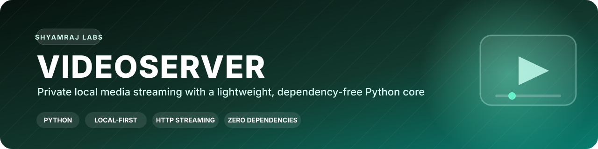
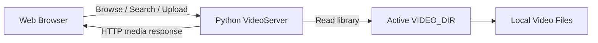

<p align="center">
  
</p>

<p align="center">
  
  
  
  
</p>

<h1 align="center">VideoServer</h1>
<p align="center"><strong>A lightweight local video library and streaming server powered by Python's standard library.</strong></p>

VideoServer lets a user browse and stream local media through a web interface without uploading the media collection to GitHub or depending on a large framework stack.

## Highlights

- Lightweight Python server with no external runtime dependencies
- Local-first media library
- Browser-based upload support
- Instant switching between local video folders
- Search by title, quality labels and release tags
- Support for common desktop video formats
- Repository code stays separate from private media files

## How it works



## Quick start

### 1. Run with the default library

```powershell
python server.py
```

The server starts at:

```text
http://127.0.0.1:5000
```

### 2. Stream from another folder

PowerShell:

```powershell
$env:VIDEO_DIR="D:\Movies"
python server.py
```

You can also paste a folder path such as `D:\Movies` into the web interface and switch the active library without waiting for a browser upload.

## Adding media

Use any of these methods:

1. Place supported files inside the local `videos/` folder.
2. Upload files through the web interface.
3. Set `VIDEO_DIR` to an existing media folder.
4. Enter a folder path directly in the interface.

The `videos/` folder is intentionally excluded from Git tracking, so local media files are not committed to the repository.

## Supported formats

| Format | Extension |
|---|---|
| MPEG-4 | `.mp4`, `.m4v` |
| QuickTime | `.mov` |
| Matroska | `.mkv` |
| WebM | `.webm` |
| AVI | `.avi` |

## Library behavior

- Uploaded videos are stored in the active `VIDEO_DIR`.
- The current library folder can be opened from the homepage.
- The active folder can be changed from the interface.
- Search supports titles, quality terms such as `1080p`, and release tags such as `x265`.
- Actual media files remain local unless the user deliberately uploads them elsewhere.

## Privacy model

VideoServer is designed around local ownership of media. The public repository contains the application code, not the user's movie or video collection.

---

<p align="center"><strong>Designed and engineered by Shyamraj.</strong></p>
