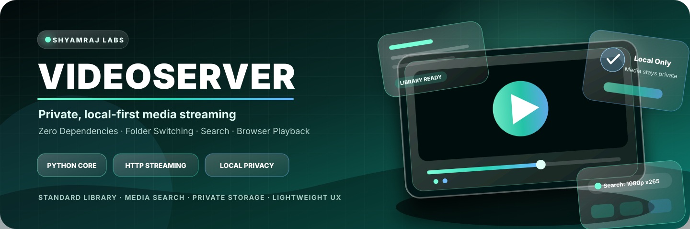
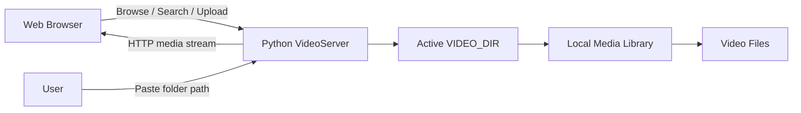
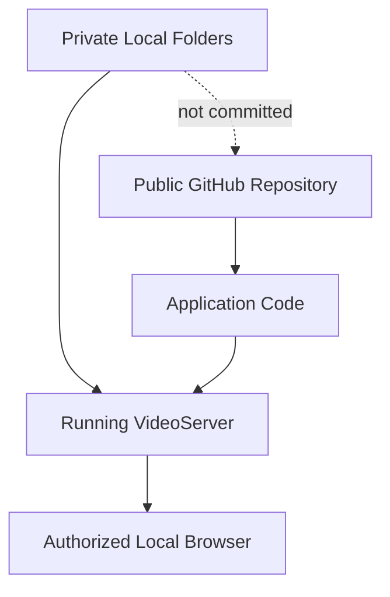

<p align="center">
  
</p>

<p align="center">
  
  
  
  
</p>

<p align="center">
  <a href="#-why-videoserver">Highlights</a> ·
  <a href="#-system-flow">Architecture</a> ·
  <a href="#-launch-the-library">Setup</a> ·
  <a href="#-media-support">Formats</a> ·
  <a href="#-privacy-model">Privacy</a>
</p>

<h1 align="center">VIDEOSERVER</h1>
<h3 align="center">A lightweight, private and local-first video library powered entirely by Python's standard library.</h3>

<p align="center">
  Browse, search, upload and stream local media from a clean web interface without moving your personal video collection into the repository or depending on a heavy framework stack.
</p>

---

## ✨ Why VideoServer

<table>
<tr>
<td width="33%" valign="top">

### 🏠 Local-First

Your media remains in folders you control. The application serves the library without treating GitHub as storage.

</td>
<td width="33%" valign="top">

### ⚡ Lightweight Core

The runtime uses Python's standard library, keeping setup small and understandable.

</td>
<td width="33%" valign="top">

### 🎬 Browser Playback

Open the local web interface, browse the active library and stream supported media formats.

</td>
</tr>
<tr>
<td width="33%" valign="top">

### 🔎 Smart Search

Filter by title, quality terms such as `1080p`, and release tags such as `x265`.

</td>
<td width="33%" valign="top">

### 📁 Instant Folder Switching

Point the application to another local folder without waiting for browser-based uploads.

</td>
<td width="33%" valign="top">

### 🔐 Private by Design

The repository contains application code—not the user's personal media collection.

</td>
</tr>
</table>

## 🎛️ Feature Matrix

| Capability | What it does | Why it matters |
|---|---|---|
| **Local library** | Reads media from the active `VIDEO_DIR` | Keeps storage under user control |
| **Browser streaming** | Serves supported video files over local HTTP | Simple playback from another browser/device on the network |
| **Upload flow** | Adds media through the web interface | Convenient for smaller transfers |
| **Folder input** | Switches to an existing directory path | Avoids unnecessary copying |
| **Search** | Filters titles and common release labels | Faster navigation in large folders |
| **Format support** | Handles common desktop video containers | Useful across mixed media collections |
| **No tracked media** | Excludes personal video files from Git | Prevents accidental repository uploads |

## 🌐 System Flow



## 🧬 Runtime Design

```text
Browser Interface
      │
      ├── Library listing
      ├── Search and filters
      ├── Upload action
      └── Folder switching
      │
Python Standard-Library Server
      │
      ├── Local file discovery
      ├── Supported-format validation
      ├── HTTP media responses
      └── Active VIDEO_DIR management
      │
Private Local Storage
```

## 🚀 Launch the Library

<details open>
<summary><strong>Run with the default media folder</strong></summary>

```powershell
python server.py
```

Open:

```text
http://127.0.0.1:5000
```

</details>

<details open>
<summary><strong>Run with another folder</strong></summary>

PowerShell:

```powershell
$env:VIDEO_DIR="D:\Movies"
python server.py
```

You can also enter a folder path such as `D:\Movies` directly in the web interface.

</details>

## 📥 Add Media

Choose the workflow that matches the library:

1. Place files inside the local `videos/` folder.
2. Upload files through the browser interface.
3. Set `VIDEO_DIR` before starting the server.
4. Paste an existing local folder path into the interface.

The `videos/` directory is intentionally excluded from Git tracking.

## 🎞️ Media Support

| Container | Extensions |
|---|---|
| MPEG-4 | `.mp4`, `.m4v` |
| QuickTime | `.mov` |
| Matroska | `.mkv` |
| WebM | `.webm` |
| AVI | `.avi` |

## 🔍 Search Experience

Search can match:

- Full or partial video titles
- Quality labels such as `720p`, `1080p` or `4K`
- Encoding and release tags such as `x264`, `x265` or `HEVC`
- Other filename text inside the active library

## 🔐 Privacy Model



### Privacy principles

- Media files stay in local folders unless the user deliberately moves them.
- The repository contains only the application code and documentation.
- The `videos/` folder is not tracked by Git.
- Folder switching does not upload an entire library to GitHub.
- Users remain responsible for controlling network access to the running server.

## 🧠 Design Philosophy

> Keep the server small. Keep the media local. Keep the workflow understandable.

VideoServer is intentionally simpler than a full media-management platform. Its value is directness: select a folder, open the browser and play the library.

## 🗺️ Evolution Roadmap

- [x] Local Python streaming server
- [x] Folder-based media library
- [x] Browser upload flow
- [x] Runtime folder switching
- [x] Search by title and release labels
- [x] Multiple common video formats
- [ ] Optional access-control layer
- [ ] Richer media metadata and thumbnails
- [ ] Network and playback diagnostics

---

<p align="center">
  <strong>Designed and engineered by Shyamraj.</strong><br/>
  <sub>Local-first software · Python · Practical media tools</sub>
</p>
